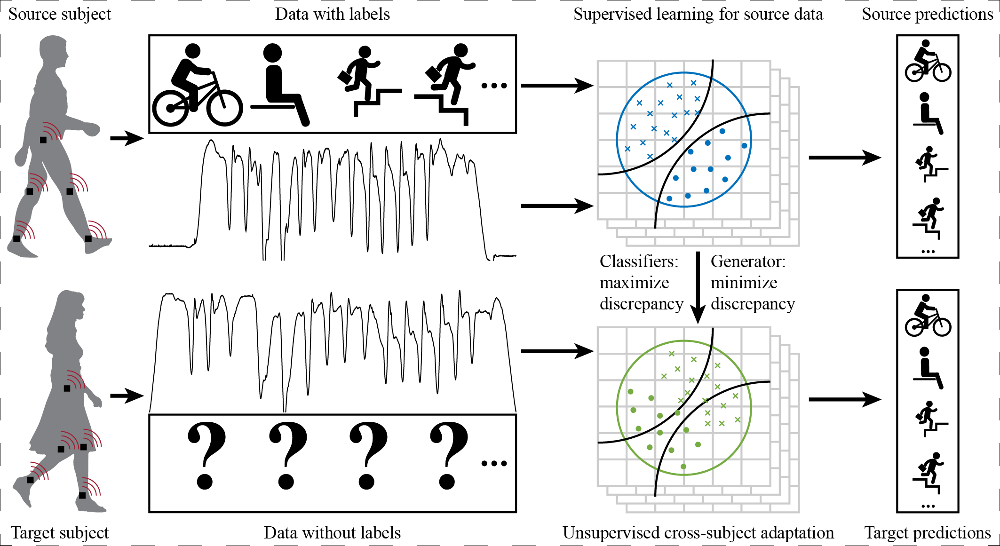

## Unsupervised Cross-subject Adaptation for Predicting Human Locomotion Intent



This is the implementation of Unsupervised Cross-subject Adaptation for Predicting Human Locomotion Intent in Pytorch.

## Getting Started
### Installation
```
pip install -r requirements.txt
```

### Download dataset
If you can use google drive, you don't need to download the data manually and just run the code shown below.

If you cannot use google drive, you need to download the dataset and checkpoint from the link below:

```
https://alumniubcca-my.sharepoint.com/:f:/g/personal/kuangen_zhang_alumni_ubc_ca/EmYydTnluklBn17qVXnSIWoBvBq0arhyATCaVlYXVs4PhA?e=evB0s7
```

### Test
```
python code/main_MCD.py --eval_only True
```

### Train
```
python code/main_MCD.py
```

## Contact

For more related works and codes, please view my homepage: https://sites.google.com/view/kuangenzhang

Further information please contact Kuangen Zhang (kuangen.zhang@alumni.ubc.ca).

## Citation
If you find our work useful in your research, please consider citing:
```bash
@ARTICLE{zhang_unsupervised_2020,
author={K. {Zhang} and J. {Wang} and C. W. {De Silva} and C. {Fu}},
journal={IEEE Transactions on Neural Systems and Rehabilitation Engineering},
title={Unsupervised Cross-subject Adaptation for Predicting Human Locomotion Intent},
year={2020},
volume={},
number={},
pages={1-1},
keywords={Cross-subject adaptation;unsupervised learning;human intent classification;wearable robots},
doi={10.1109/TNSRE.2020.2966749},
ISSN={1558-0210},
month={},}
```

## Acknowledgement
We acknowledge that we borrow the code from [MCD_DA](https://github.com/mil-tokyo/MCD_DA) heavily. 

## Reference
*  K. Saito, K. Watanabe, Y. Ushiku, and T. Harada, “Maximum classifier
discrepancy for unsupervised domain adaptation,” in 2018 IEEE/CVF
Conference on Computer Vision and Pattern Recognition. Salt Lake
City, UT, USA: IEEE, Jun. 2018, pp. 3723–3732.
